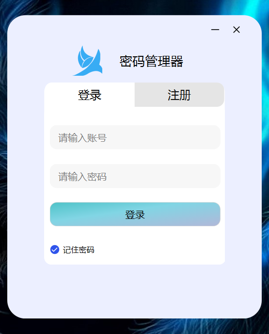
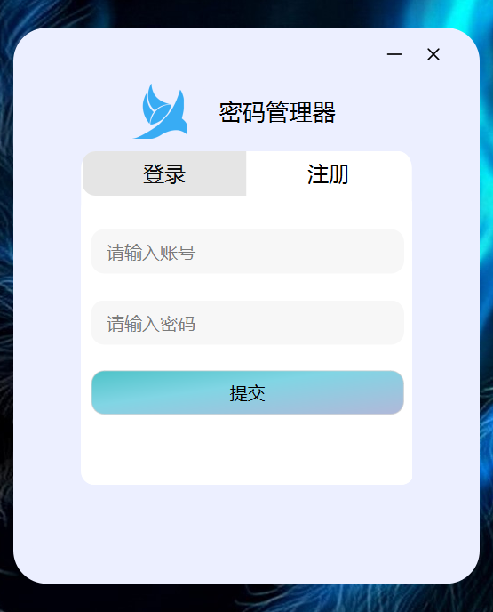
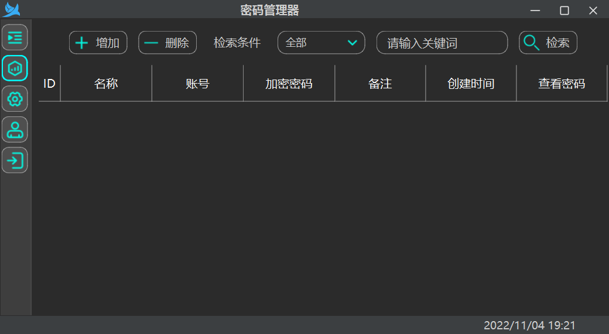
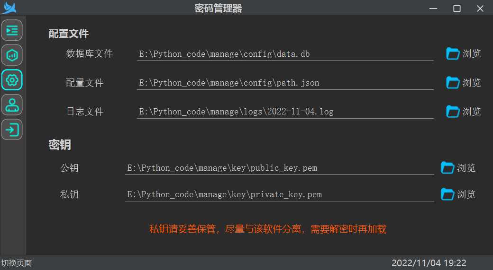
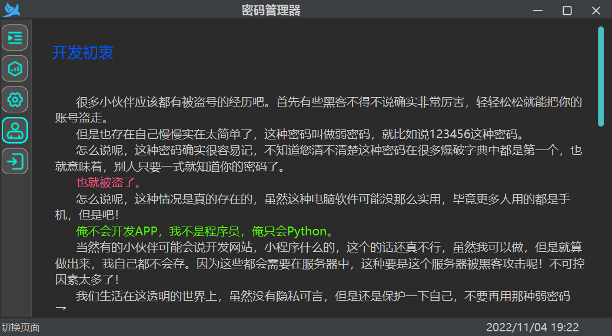

## 密码管理器 食用指北
***
### 用途
这是一个 _Python3_ 基于pyside6开发的一个密码管理器，用于加密存储我们在日常中的各种密码。解决使用复杂密码但是又怕记不住，简单密码有不安全的老大难问题。

**功能**
* 多用户使用
* 数据本地化管理
* 本地存储使用多种加密方式
***
### 开发初衷

很多小伙伴应该都有被盗号的经历吧。首先有些黑客不得不说确实非常厉害，轻轻松松就能把你的账号盗走。

但是也存在自己慢慢实在太简单了，这种密码叫做弱密码，就比如说123456这种密码。

怎么说呢，这种密码确实很容易记，不知道您清不清楚这种密码在很多爆破字典中都是第一个，也就意味着，别人只要一式就知道你的密码了。

`也就被盗了。`

怎么说呢，这种情况是真的存在的，虽然这种电脑软件可能没那么实用，毕竟更多人用的都是手机，但是吧！

俺不会开发APP，我不是程序员，俺只会Python。

当然有的小伙伴可能会说开发网站，小程序什么的，这个的话还真不行，虽然我可以做，但是就算做出来，我自己都不会存。因为这些都会需要在服务器中，这种要是这个服务器被黑客攻击呢！不可控因素太多了！

我们生活在这透明的世界上，虽然没有隐私可言，但是还是保护一下自己，不要再用那种弱密码了。
实现功能
***
### 准备工作

您需要准备以下东西
* _Python3.9_ 及以上版本(或自行改写旧版不兼容的语法)
* _peewee_ 3.15.3
* _pycryptodome_ 3.15.0 或其等价替代
* _PySide6_ 6.3.2  部分版本需要自行修改窗口移动代码，会存在不兼容
***
### 如何使用
***
#### 源码运行

执行 `pip install -r requirements.txt` 即可安装依赖

* main.py  运行主文件

* path.py     项目路径管理
* login.py    用户注册登录
* model.py    orm数据库
* Global/GlobalVariable.py  全局变量[除level外不建议修改， 一般运行请将其设置为INFO]

DEBUG 模式会输出敏感信息，非必要不要使用
***
#### 已经打包好的免安装
蓝奏云 https://wwm.lanzoum.com/b027w38oh

密码:apaw

二维码

***

### 最后

程序在使用过程中所存储的数据都在本地数据库中，请勿随意将私钥以及数据库泄露

为了保证数据安全，软件不会联网请求！！！！！！

不会自动更新等等。

所有代码均已经开源，可以共同监督！

软件中最重要的数据都经过加密，但是如果有私钥存在也是可以解密的，所以使用过程中请妥善保管。

内置随机密码生成：

	大写字母：A,B,C…Z;
	小写字母：a,b,c…z;
	数字：0,1,2…9;
	特殊符号：~,!,@,#,$,%,^;

### 运行截图

`登录`

  

`注册`

`主界面`

  

`设置界面`

 

`关于界面`

 

### 捐赠

    
    

***

### 更新管理

#### 2022/11/12
* 增加自动复制密码
* 更新UI

#### 2022/11/11
* 修复存储账号字段太少
* 增加查看密码需要登录密码验证
